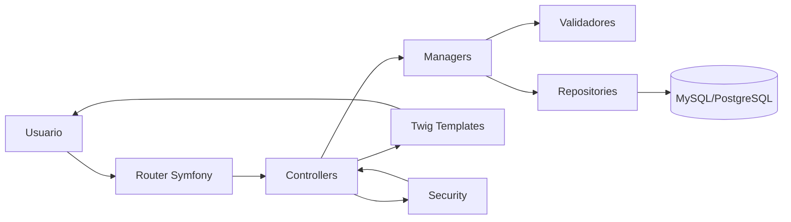

# SGT

Sistema de gestión de torneos de fútbol construido con Symfony 6.4, Doctrine ORM y PHPUnit.

## Quick Start

Desde la raíz de [entorno-php](../../):

```bash
./iniciar.sh
./consola.sh
cd /var/www/html/sgt
composer install
php bin/console doctrine:migrations:migrate
```

Acceso local: http://localhost:8080/sgt/public/

## Propósito

Este módulo concentra la lógica y la interfaz para administrar y consultar la estructura de un torneo:

- torneos
- categorías
- equipos
- grupos
- partidos
- canchas
- sedes
- jugadores
- usuarios

La aplicación expone controladores, managers, repositorios y entidades para operar sobre ese dominio, con vistas Twig y soporte de autenticación/autorización.

## Desarrollo

### Stack

- PHP 8.1+
- Symfony 6.4
- Doctrine ORM / DBAL
- Twig
- PHPUnit 9.5
- Symfony Security

### Estructura principal

- [src/Controller](src/Controller) - controladores web.
- [src/Entity](src/Entity) - entidades de dominio y mapeo ORM.
- [src/Manager](src/Manager) - lógica de negocio y casos de uso.
- [src/Repository](src/Repository) - consultas y persistencia.
- [src/Security](src/Security) - autenticación y autorización.
- [templates](templates) - vistas Twig.
- [config](config) - configuración de Symfony, rutas y servicios.
- [tests](tests) - pruebas Unit, Integration y Functional.
- [docs](docs) - documentación técnica del módulo.

### Puntos de entrada

- La ruta principal es /, resuelta por MainController.
- Las rutas de torneo viven bajo /torneo/{ruta}.
- Los controladores se registran por atributos en [config/routes.yaml](config/routes.yaml).

### Endpoints principales

| Método | Ruta | Controlador | Nombre de ruta |
|---|---|---|---|
| GET | / | MainController::index | app_main |
| GET | /torneo/{ruta} | MainController::torneo | app_main_torneo |
| GET | /torneo/{ruta}/categoria/{categoriaId} | MainController::categoria | app_main_categoria |
| GET/POST | /login | SecurityController::login | security_login |
| GET | /logout | SecurityController::logout | security_logout |
| GET | /admin/torneo/ | TorneoController::index | admin_torneo_index |
| GET/POST | /admin/torneo/nuevo | TorneoController::crear | admin_torneo_crear |
| GET/POST | /admin/torneo/{ruta}/editar | TorneoController::editar | admin_torneo_editar |
| GET/POST | /admin/torneo/{ruta}/categoria/nuevo | CategoriaController::crear | admin_categoria_crear |
| GET/POST | /admin/torneo/{ruta}/categoria/{categoriaId}/equipo/nuevo | EquipoController::crear | admin_equipo_crear |
| GET/POST | /admin/torneo/{ruta}/categoria/{categoriaId}/equipo/{equipoId}/jugador/nuevo | JugadorController::crear | admin_jugador_crear |
| GET/POST | /admin/torneo/{ruta}/categoria/{categoriaId}/partido/crear | PartidoController::crear | admin_categoria_partido_crear |

Para listar todas las rutas del proyecto:

```bash
php bin/console debug:router
```

### Requisitos

- PHP 8.1 o superior.
- Composer.
- Extensiones de PHP requeridas por Symfony y Doctrine.
- Base de datos configurada en el entorno del proyecto.

### Instalación manual (sin scripts)

1. Instalar dependencias:

```bash
composer install
```

2. Revisar variables de entorno en `.env`, `.env.local` o `.env.test`.

3. Ejecutar migraciones si corresponde:

```bash
php bin/console doctrine:migrations:migrate
```

4. Levantar el servidor de desarrollo o usar el entorno local del repositorio.

### Entorno local con Docker

Este módulo vive dentro del repositorio [entorno-php](../../), que ya incluye scripts para levantar servicios de desarrollo.

1. Desde la raíz de entorno-php, levantar contenedores:

```bash
./iniciar.sh
```

2. Entrar al contenedor PHP:

```bash
./consola.sh
```

3. Dentro del contenedor, ir al proyecto Symfony y preparar dependencias:

```bash
cd /var/www/html/sgt
composer install
php bin/console doctrine:migrations:migrate
```

4. Accesos comunes del entorno:

- Aplicación PHP/Apache: http://localhost:8080/sgt/public/
- phpMyAdmin: http://localhost:8081
- Frontend Vite (si se usa): http://localhost:5173

Servicios relevantes en [docker-compose.yml](../../docker-compose.yml):

- server-php-apache
- server-mysql
- server-phpmyadmin
- server-node

### Pruebas

El proyecto divide las pruebas en tres suites:

- Unit
- Integration
- Functional

Comandos disponibles:

```bash
composer test
composer phpstan
composer phpcs
composer quality
composer test:unit
composer test:integration
composer test:functional
composer test:coverage
composer test:coverage:check
composer test:ci
```

La estrategia de testing está documentada en [TESTING.md](TESTING.md).

## Operación

### Despliegue

No hay pipeline de despliegue documentado en este módulo. Como base mínima para un entorno estable:

- usar APP_ENV=prod
- configurar secretos y DATABASE_URL por variables de entorno
- ejecutar migraciones controladas antes del cambio de tráfico
- validar suites de pruebas (composer test:ci) en CI antes de publicar

### Arquitectura y flujo



Flujo de negocio típico:

1. Un controlador recibe la request.
2. El manager aplica reglas de negocio y validaciones.
3. El repositorio consulta o persiste entidades.
4. El controlador responde con vista Twig o redirección.

### Documentación adicional

- [TESTING.md](TESTING.md) - estrategia y criterios de validación.
- [docs/phpunit-argument-injection.md](docs/phpunit-argument-injection.md) - nota de seguridad sobre inyección de argumentos en PHPUnit.
- [docs/troubleshooting.md](docs/troubleshooting.md) - problemas frecuentes, diagnóstico y resolución.

### Notas

- Los controladores y managers muestran una separación clara entre presentación y lógica de negocio.
- Las entidades representan el dominio principal del sistema deportivo.
- La cobertura objetivo del proyecto se gestiona desde la suite de pruebas y el job de CI.